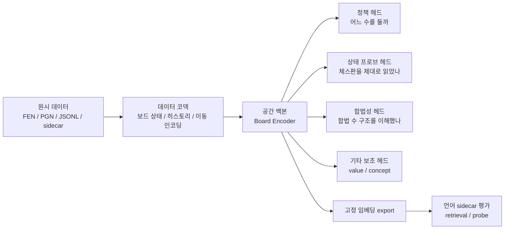

# ModalChess 아키텍처

## 한 줄 요약

ModalChess는 체스판을 **문자열 한 줄**로만 보지 않고, **8x8 공간 세계**로 본다.  
그리고 모델은

1. 체스판을 읽고
2. 어느 칸의 말을 어느 칸으로 옮길지 생각하고
3. 자기가 체스판을 제대로 이해했는지 스스로 검사하고
4. 그 위에 나중에 붙일 언어 실험은 일단 **평가 전용**으로만 다룬다.

## 초등학생 버전 설명

아주 쉽게 말하면 ModalChess는 이런 로봇이다.

- 먼저 체스판 사진을 본다.
- 사진 속에 말이 어디에 있는지 본다.
- "어느 칸의 말을, 어느 칸으로 옮기면 좋을까?"를 생각한다.
- "내가 지금 체스판을 제대로 읽었나?"도 같이 확인한다.
- 나중에는 사람이 남긴 설명글도 같이 보려고 준비 중이지만, 아직은 **설명글을 보고 시험만 보는 단계**다.

즉, 지금 ModalChess는

- **체스판을 잘 읽는 두뇌**
- **수를 고르는 머리**
- **자기 이해가 맞는지 검사하는 장치**
- **미래의 언어 연결을 위한 준비물**

로 이루어져 있다.

## 왜 이렇게 만들었나

보통 체스를 문자열로만 보면 이런 문제가 생긴다.

- 말이 어디에 있는지 바로 보기가 어렵다.
- 캐슬링, 앙파상, 프로모션 같은 규칙이 헷갈릴 수 있다.
- 나중에 "왜 이 수를 뒀는지" 설명하는 언어 모델과 연결할 때, 보드의 실제 공간 구조가 약해질 수 있다.

그래서 ModalChess는 체스판을 **공간적으로 읽는 모델**을 중심에 둔다.

## 큰 그림

## 현재 시스템을 아주 쉽게 나누면

### 1. 입력층

여기는 "체스판을 컴퓨터가 먹을 수 있는 모양"으로 바꾸는 곳이다.

- FEN을 읽는다.
- 필요하면 이전 장면들도 같이 읽는다.
- 체스판을 8x8 격자 여러 장으로 바꾼다.
- 이동도 `출발 칸`, `도착 칸`, `프로모션 종류`로 나눠서 다룬다.

쉬운 말로 하면:

- 사람은 체스판을 보고 "아, 여기에 백 퀸이 있네"라고 생각한다.
- 컴퓨터는 그런 생각을 못하니, 말 종류별로 칸을 색칠한 지도 여러 장이 필요하다.

### 2. 핵심 두뇌층

여기가 ModalChess의 진짜 중심이다.

- 64칸을 각각 하나의 토큰처럼 다룬다.
- 각 칸이 주변 칸과 어떤 관계인지 본다.
- 여러 층을 지나면서 "지금 이 보드에서는 뭐가 중요하지?"를 압축한다.

쉬운 말로 하면:

- 체스판 64칸에 각각 작은 학생이 하나씩 앉아 있다.
- 각 학생은 "내 칸에 뭐가 있지?"를 말한다.
- 그러고 서로 이야기하면서 "왕이 위험한가?", "이 말은 움직일 수 있나?" 같은 전체 상황을 이해한다.

### 3. 출력층

두뇌가 생각한 결과를 여러 개의 입으로 내보낸다.

- 정책 헤드: 다음 수를 고른다.
- 상태 프로브 헤드: 말 배치와 메타 상태를 다시 맞혀 본다.
- 합법성 헤드: 어떤 수 구조가 합법에 가까운지 본다.
- value / concept 헤드: 추가적인 보조 신호를 낸다.

쉬운 말로 하면:

- 한 입은 "이 수를 두자"라고 말하고
- 다른 입은 "내가 본 체스판은 이런 모습이야"라고 말하고
- 또 다른 입은 "이런 방향의 수는 합법 같아"라고 말한다.

이렇게 여러 입을 두는 이유는, 단순히 정답 수만 맞히는 로봇이 아니라 **보드 자체를 제대로 이해하는 로봇**을 만들기 위해서다.

## 데이터 계층

### 핵심 철학

입력으로 넣어도 되는 것과 넣으면 안 되는 것을 엄격히 나눈다.

넣으면 안 되는 것:

- legal move mask
- attacked squares
- in-check label
- engine eval
- mate threat label

이런 것은 정답, 평가, 검사용으로는 써도 되지만 **입력 특징으로 넣으면 안 된다**.

이 규칙은 연구의 공정성을 지키는 핵심이다.

### 핵심 데이터 구조

주요 구조는 아래와 같다.

- `BoardMeta`
- `BoardState`
- `FactorizedMove`
- `PositionSample`

관련 파일:

- [schema.py](../src/modalchess/data/schema.py)
- [board_state.py](../src/modalchess/data/board_state.py)
- [fen_codec.py](../src/modalchess/data/fen_codec.py)
- [tensor_codec.py](../src/modalchess/data/tensor_codec.py)
- [move_codec.py](../src/modalchess/data/move_codec.py)

### 보드 텐서는 어떻게 생겼나

한 장면(snapshot)마다 최소 18개 채널을 쓴다.

- 백 말 6종
- 흑 말 6종
- 현재 차례 1장
- 캐슬링 권리 4장
- 앙파상 대상 1장

그래서 한 장면은 `[18, 8, 8]`이고, 히스토리를 붙이면 `[H, 18, 8, 8]`이 된다.

쉬운 말로 하면:

- "백 폰 전용 지도"
- "흑 퀸 전용 지도"
- "지금 백 차례인지 알려주는 지도"

같은 지도를 여러 장 겹쳐 놓은 것이다.

### 좌표 규칙

이 부분은 절대 헷갈리면 안 된다.

- move codec 인덱스는 `python-chess`
  - `a1 = 0`
  - `h8 = 63`
- 텐서 좌표는 백 시점
  - `row 0, col 0 = a8`
  - `row 7, col 7 = h1`

관련 파일:

- [square_utils.py](../src/modalchess/utils/square_utils.py)
- [test_square_utils.py](../tests/test_square_utils.py)

## 모델 계층

### Board Encoder

현재 핵심 인코더는 공간형 보드 인코더다.

하는 일:

1. 각 칸의 히스토리 채널을 모은다.
2. 각 칸을 벡터로 바꾼다.
3. 2D 위치 정보를 더한다.
4. Transformer 스타일 블록으로 처리한다.
5. 64칸 표현과 pooled 표현을 만든다.

관련 파일:

- [board_encoder.py](../src/modalchess/models/board_encoder.py)
- [spatial_positional_encoding.py](../src/modalchess/models/spatial_positional_encoding.py)
- [relation_bias.py](../src/modalchess/models/relation_bias.py)

### 왜 칸 단위 토큰을 쓰나

문장을 읽는 Transformer는 보통 단어 토큰을 쓴다.  
ModalChess는 단어 대신 **체스판의 64칸**을 토큰처럼 쓴다.

그래서 모델은 이렇게 생각할 수 있다.

- "e4 칸에는 뭐가 있지?"
- "g7과 h8은 가까이 있네"
- "같은 파일에 있는 말들이 서로 관련 있네"

### relation bias는 뭐냐

relation bias는 "이 두 칸은 어떤 관계인가?"를 조금 더 직접 알려주는 선택형 부품이다.

예:

- 같은 줄(rank)인가?
- 같은 세로줄(file)인가?
- 같은 대각선인가?
- 나이트처럼 떨어져 있나?
- 킹 한 칸 거리인가?

이건 필수는 아니고, ablation 때 켜고 끌 수 있게 분리되어 있다.

## 정책 계층

### 왜 수를 한 번에 안 고르나

ModalChess는 수를 한 덩어리 문자로 바로 고르지 않는다.

대신 이렇게 나눈다.

1. 어디 칸에서 출발할까?
2. 어디 칸으로 갈까?
3. 프로모션이면 무엇으로 바꿀까?

이걸 factorized move policy라고 한다.

쉬운 말로 하면:

- "어느 말을 집을래?"
- "어디에 놓을래?"
- "폰이 끝까지 갔으면 뭘로 바꿀래?"

를 따로 생각하는 것이다.

### pair scorer는 왜 있나

출발 칸과 도착 칸을 따로만 보면,

- "이 출발 칸은 좋아 보임"
- "이 도착 칸도 좋아 보임"

까지만 알 수 있다.

하지만 실제로는 **둘의 조합**이 중요하다.

그래서 pair scorer는

- `출발 칸 u`
- `도착 칸 v`

를 같이 보고 "이 두 칸 조합은 진짜 그럴듯한가?"를 더 본다.

week-2에서 `axis_only < listwise < pair`가 나왔기 때문에, 지금은 pair scorer가 켜진 구조가 정식 백본이다.

관련 파일:

- [policy_factorized.py](../src/modalchess/models/heads/policy_factorized.py)

## 보조 헤드 계층

### State Probe Head

이 헤드는 모델이 체스판을 제대로 읽었는지 검사한다.

맞혀보는 것:

- 현재 말 배치
- 현재 차례
- 캐슬링 권리
- 앙파상
- 체크 상태

쉬운 말로 하면:

시험 문제를 맞힌 뒤에 선생님이 다시 묻는 것이다.

- "그런데 너 지금 체스판에 뭐가 있었는지는 제대로 봤니?"

이 헤드 덕분에 모델이 **그냥 정답 수만 외우는지**, 아니면 **판 자체를 이해하는지**를 구분할 수 있다.

관련 파일:

- [state_probe.py](../src/modalchess/models/heads/state_probe.py)

### Legality Head

이 헤드는 합법 수 구조를 얼마나 잘 잡았는지 본다.

중요한 점:

- legal move mask를 입력으로 넣지는 않는다.
- 대신 출력/보조 목표로 "합법성"을 예측하게 한다.

즉,

- 입력에서는 정답을 몰래 알려주지 않고
- 학습 후에는 "합법 구조를 배웠나?"를 검사한다.

관련 파일:

- [legality.py](../src/modalchess/models/heads/legality.py)

### Value / Concept Head

이 둘은 지금 핵심 승부처는 아니지만, 미래 확장을 위해 구조를 유지한다.

- Value head: 이 상태가 좋나 나쁘나를 숫자로 본다.
- Concept head: 체크, 핀, 포크 같은 개념 태그를 본다.

현재 데이터에서는 dense label이 충분하지 않아서, week-3 이후에도 이 둘은 중심 연구축이 아니었다.

관련 파일:

- [value.py](../src/modalchess/models/heads/value.py)
- [concept.py](../src/modalchess/models/heads/concept.py)

## 학습 계층

### 현재 정식 supervised backbone

week-1부터 week-3까지의 결과를 거쳐 현재 정식 백본은 아래처럼 정리되어 있다.

#### G1: primary backbone

- spatial backbone
- pair scorer ON
- listwise loss ON
- state probe ON
- legality OFF

이게 현재의 주력 백본이다.

#### G3: required control

- spatial backbone
- pair scorer ON
- listwise loss ON
- state probe ON
- legality ON

이건 반드시 같이 봐야 하는 대조군이다.

왜냐하면 language-side 평가에서는

- 어떤 경우는 G1이 더 좋고
- 어떤 경우는 G3가 더 좋기 때문이다.

즉, 지금은 "무조건 G1만 보면 된다" 상태가 아니다.

이 기준에 맞는 정식 연구용 config는 다음이다.

- [configs/train/week3_ground_state.yaml](../configs/train/week3_ground_state.yaml): G1
- [configs/train/week3_ground_state_legality.yaml](../configs/train/week3_ground_state_legality.yaml): G3

반대로 로컬 회귀/스모크 실행용 config는 별도로 둔다.

- [configs/train/smoke_default.yaml](../configs/train/smoke_default.yaml): 빠른 local smoke
- [configs/train/default.yaml](../configs/train/default.yaml): pair scorer ON, legality/value/concept OFF인 local G1-aligned baseline

즉, smoke config와 공식 연구용 backbone config를 같은 것으로 취급하지 않는다.

### 손실 함수는 어떻게 섞이나

학습은 여러 손실의 조합으로 이뤄진다.

- policy loss
- state probe loss
- legality loss
- value loss
- concept loss

하지만 모든 실험이 모든 손실을 항상 켜는 것은 아니다.  
실험 목적에 따라 켜고 끈다.

관련 파일:

- [losses.py](../src/modalchess/train/losses.py)
- [trainer.py](../src/modalchess/train/trainer.py)
- [train_spatial_baseline.py](../src/modalchess/train/train_spatial_baseline.py)

## 평가 계층

현재 평가는 크게 두 종류다.

### 1. 정책 품질 평가

- top-1
- top-3
- top-5
- target move NLL

즉, "정답 수를 얼마나 잘 맞히는가?"를 본다.

### 2. 상태 충실도 평가

- occupied square accuracy
- piece macro F1
- legality AP/F1
- 기타 상태 복원 지표

즉, "체스판 자체를 얼마나 제대로 이해했는가?"를 본다.

관련 파일:

- [metrics_move_quality.py](../src/modalchess/eval/metrics_move_quality.py)
- [metrics_state_fidelity.py](../src/modalchess/eval/metrics_state_fidelity.py)
- [eval_baseline.py](../src/modalchess/eval/eval_baseline.py)

### 3. legal-conditioned와 raw honesty diagnostics는 다르다

move quality는 이제 두 층으로 나눠 본다.

- legal-conditioned metrics:
  - `top_1`, `top_3`, `top_5`
  - `target_move_nll`
  - 의미: 합법 수 집합 안에서 정답 수를 얼마나 잘 고르나
- raw honesty diagnostics:
  - `illegal_top_1_rate`
  - `raw_top_1_is_legal_rate`
  - `legal_mass`
  - `illegal_mass`
  - `raw_target_move_nll`
  - `raw_top_1`, `raw_top_3`, `raw_top_5`
  - 의미: legality masking 이전 전체 factorized action space에서 얼마나 불법 수에 질량을 뿌리나

즉, 기존 top-k가 "합법 수 안에서의 랭킹 품질"이라면, honesty diagnostics는 "raw policy가 얼마나 정직한가"를 본다.

### 가장 중요한 checkpoint 선택 규칙

`best_model.pt`의 의미는 backward compatible하게 유지한다.

- validation이 있는 run에서는 **best checkpoint = policy-best = lowest `val.target_move_nll`** 이다.
- validation이 없는 run에서는 backward compatibility를 위해 마지막 epoch checkpoint를 `best_model.pt`로도 남긴다.

하지만 이제 보고는 하나로 끝내지 않는다.

- `best_policy_model.pt`: `best_model.pt`와 같은 policy-best
- `best_grounding_model.pt`: `mean(val.occupied_square_accuracy, val.piece_macro_f1, val.legality_average_precision)` 최대
- `selection_summary.json/csv`: epoch별 policy score, grounding score, winner 표시
- `pareto_epochs.json`: policy NLL과 grounding 축 사이에서 non-dominated epoch 요약

이렇게 남기는 이유는, move policy 하나만 잘 맞는 checkpoint와 state-grounding이 더 좋은 checkpoint가 다를 수 있기 때문이다.

## 언어 계층: 지금 어디까지 왔나

### 아직 안 하는 것

아직 하지 않는 것:

- connector training
- LLM fusion
- rationale generator training
- RL / self-play

즉, "말 잘하는 큰 모델"을 아직 붙이지 않았다.

### 지금 하는 것

지금 하는 것은 **평가 전용 언어 경로**다.

즉,

- 고정된 체스 백본에서 임베딩을 뽑고
- 외부 comment / sidecar / puzzle theme와 얼마나 잘 맞는지
- retrieval이나 작은 probe로만 본다

### 왜 eval-only인가

정확히 겹치는 board+move+text 학습 데이터가 아직 충분히 깨끗하지 않기 때문이다.

그래서 지금은 보수적으로:

- 먼저 데이터 품질을 올리고
- split hygiene를 점검하고
- frozen embedding에 언어 신호가 있는지 본다

라는 순서로 간다.

## week-9에서 새로 추가된 것

### Annotated PGN move-conditioned sidecar

week-9의 핵심은 Waterhorse annotated PGN를 **게임 단위 텍스트**가 아니라 **수 단위 코멘트 sidecar**로 바꾼 것이다.

각 row는 이런 뜻을 가진다.

- 이 포지션에서
- 이 수를 두었고
- 다음 포지션은 이것이며
- 사람 코멘트는 이것이다

즉, 예전보다 훨씬 더 "이 수에 대한 설명"에 가깝다.

관련 파일:

- [annotated_pgn_sidecar.py](../src/modalchess/data/annotated_pgn_sidecar.py)
- [build_annotated_pgn_sidecar.py](../scripts/build_annotated_pgn_sidecar.py)
- [report_annotated_sidecar.py](../scripts/report_annotated_sidecar.py)

### week-9의 의미

이전에는

- game-level text
- synthetic tag-string
- coarse keyword labels

위주였다.

이제는

- real comment text
- move-conditioned rows
- board + move + next board + comment

구조를 가진 sidecar가 생겼다.

이건 미래의 작은 frozen alignment를 시도할 수 있게 만드는 중요한 발판이다.

## 현재 아키텍처를 비유로 다시 말하면

ModalChess는 하나의 학교처럼 볼 수 있다.

### 체육관 바닥

체스판 그 자체다.

- 8x8 칸
- 말 배치
- 차례
- 캐슬링
- 앙파상

### 학생들

64칸 각각의 토큰이다.

각 학생은 자기 칸 정보를 갖고 있다.

### 담임 선생님

Board Encoder다.

학생들의 말을 듣고 전체 상황을 정리한다.

### 시험지 채점기

Policy head다.

"다음 수가 뭐냐?"를 맞힌다.

### 이해도 확인 선생님

State probe head다.

"너 진짜 체스판을 제대로 봤니?"를 물어본다.

### 규칙 검사 선생님

Legality head다.

"그 수가 체스 규칙 구조에 맞는 쪽이니?"를 본다.

### 독후감 담당 선생님

언어 sidecar 평가다.

아직 글을 직접 쓰게 하진 않지만,
"이 체스 생각과 이 코멘트가 서로 잘 맞니?"를 시험만 본다.

## 파일 기준으로 보면 어디에 뭐가 있나

### 데이터

- [data](../src/modalchess/data)

### 모델

- [models](../src/modalchess/models)

### 학습

- [train](../src/modalchess/train)

### 평가

- [eval](../src/modalchess/eval)

### 실험 설정

- [configs](../configs)

### 테스트

- [tests](../tests)

## 지금 아키텍처가 말해 주는 것

현재 ModalChess는 이미 아래를 갖췄다.

- 체스판을 공간적으로 읽는 백본
- factorized move policy
- pair scorer
- state grounding
- legality-aware control
- eval-only language probe 경로
- move-conditioned comment sidecar

하지만 아직 아래는 안 했다.

- 실제 alignment training
- LLM fusion
- rationale generation training
- RL

즉, 지금은

"체스 두뇌를 잘 만들고, 그 두뇌가 언어와 얼마나 연결될 준비가 되었는지 조심스럽게 시험하는 단계"

라고 보면 된다.

## 현재 결론

아주 쉽게 정리하면:

- ModalChess의 몸통은 **공간 체스 두뇌**다.
- 이 두뇌는 **다음 수를 고르는 일**과 **체스판을 제대로 이해하는 일**을 함께 배운다.
- 지금의 주력 두뇌는 **G1**이고, **G3**는 꼭 같이 봐야 하는 대조군이다.
- 언어 쪽은 아직 **훈련이 아니라 평가**만 하고 있다.
- week-9부터는 실제 사람이 단 수별 코멘트를 붙인 **move-conditioned sidecar**가 생겼다.

그래서 다음 단계는 "바로 큰 언어 모델을 붙이는 것"이 아니라,

**작고 얼린(frozen) 정렬 실험을 아주 조심스럽게 시도할 수 있는지 보는 것**

에 가깝다.
